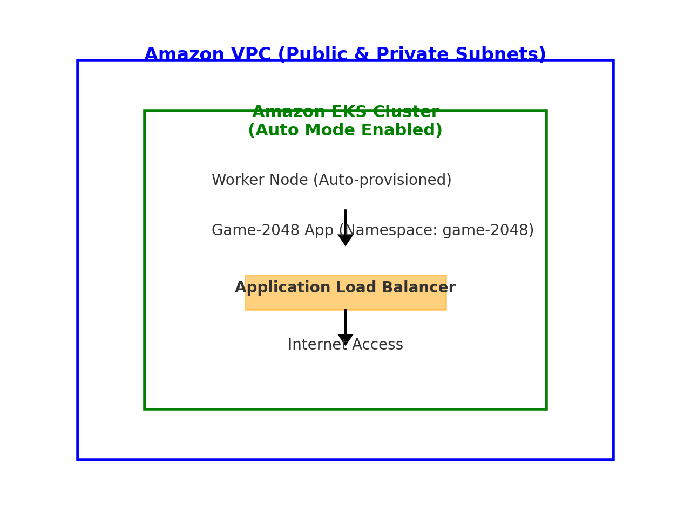

````markdown
# 🚀 EKS Auto Mode Cluster Setup with eksctl

This guide walks you through creating an **Amazon EKS** cluster using **eksctl** with **EKS Auto Mode** enabled for automated node provisioning, dynamic scaling, and integrated load balancing.

---

## 📋 Prerequisites

Before proceeding, ensure the following tools are installed and configured:

1. **AWS CLI** – [Install AWS CLI](https://docs.aws.amazon.com/cli/latest/userguide/install-cliv2.html)  
   ```bash
   aws configure
````

Configure your AWS credentials and default region.

2. **eksctl** – [Install eksctl](https://eksctl.io/introduction/#installation)
   Command-line tool for creating and managing EKS clusters.

3. **kubectl** – [Install kubectl](https://kubernetes.io/docs/tasks/tools/#kubectl)
   Kubernetes CLI for interacting with the cluster.

---

## 🌐 VPC Configuration

When using the `eksctl` cluster template provided in this guide:

* `eksctl` automatically **creates an IPv4 VPC** for your cluster.
* The VPC meets all EKS networking requirements.
* Both **public and private endpoints** are created by default.

---

## ⚙️ Instance Management

With **EKS Auto Mode**:

* Nodes are **provisioned automatically** based on workload demands.
* Idle nodes are removed to optimize costs.
* Integrated load balancing ensures application availability.

---

## 🌍 External Application Access

EKS Auto Mode provisions an **Application Load Balancer (ALB)** dynamically using the [AWS Load Balancer Controller](https://kubernetes-sigs.github.io/aws-load-balancer-controller/latest/).

---

## 🛠️ Step-by-Step Setup

### 1️⃣ Clone the Example Repository

```bash
git clone https://github.com/Adishesha72/eks-2048.git
cd eks-2048
```

### 2️⃣ Review and Edit the Cluster Configuration

Open and edit `cluster.yaml` (or `cluster-config.yaml`) as needed:

```bash
vim cluster.yaml
```

### 3️⃣ Create the EKS Cluster

```bash
eksctl create cluster -f cluster.yaml
```

📖 [eksctl create cluster reference](https://eksctl.io/usage/creating-and-managing-clusters/)

---

### 4️⃣ Deploy the Game-2048 Application

1. **Create Namespace**

   ```bash
   kubectl create namespace game-2048 --save-config
   ```

2. **Deploy Application**

   ```bash
   kubectl apply -n game-2048 -f https://raw.githubusercontent.com/kubernetes-sigs/aws-load-balancer-controller/main/docs/examples/2048/2048_full.yaml
   ```

3. **Apply Ingress Configuration**

   ```bash
   kubectl apply -f ingress.yaml
   ```

---

### 5️⃣ Delete the Cluster (Optional)

When done testing, delete the cluster to avoid charges:

```bash
eksctl delete cluster -f cluster.yaml
```

📖 [eksctl delete cluster reference](https://eksctl.io/usage/deleting-a-cluster/)

---

## 🖼 Architecture Diagram



---

## 📚 Useful Links

* [Amazon EKS Documentation](https://docs.aws.amazon.com/eks/latest/userguide/what-is-eks.html)
* [EKS Auto Mode Overview](https://docs.aws.amazon.com/eks/latest/userguide/autopilot.html)
* [AWS Load Balancer Controller](https://kubernetes-sigs.github.io/aws-load-balancer-controller/latest/)
* [eksctl Official Docs](https://eksctl.io/)

---

## ✅ Summary

With this setup:

* You get **automatic scaling** of Kubernetes worker nodes.
* **VPC and networking** are configured automatically by `eksctl`.
* The **Application Load Balancer** is dynamically provisioned for your workloads.
* The sample **Game-2048** app is deployed to verify cluster and ingress configuration.

```
